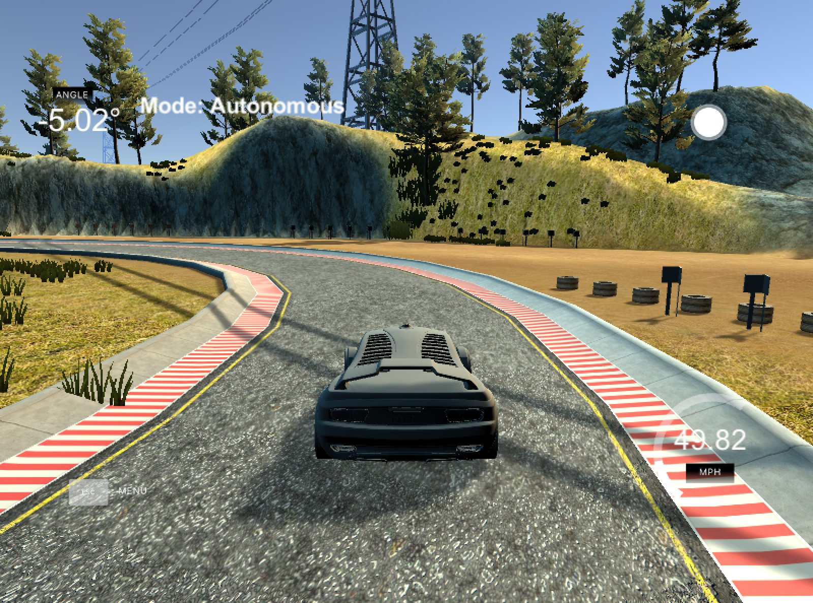

# PID Controller

Watch the full running simulator here: http://recordit.co/zXAngl1ydU/gif/notify

## Introduction

The purpose of this project was to "build a PID controller and tune the PID hyperparameters by applying the general processing flow" and to "test the solution on the simulator!" The simulator provides cross-track error (CTE), speed, and steering angle data via local websocket. The PID (proportional/integral/differential) controller must respond with steering and throttle commands to drive the car reliably around the simulator track.

## Rubric Discussion Points

- *Describe the effect each of the P, I, D components had in your implementation.*

The P, or "proportional", component had the most directly observable effect on the car's behavior. It causes the car to steer proportional (and opposite) to the car's distance from the lane center (which is the CTE) - if the car is far to the right it steers hard to the left, if it's slightly to the left it steers slightly to the right.

The D, or "differential", component counteracts the P component's tendency to ring and overshoot the center line. A properly tuned D parameter will cause the car to approach the center line smoothly without ringing.

The I, or "integral", component counteracts a bias in the CTE which prevents the P-D controller from reaching the center line. This bias can take several forms, such as a steering drift (as in the Control unit lessons), but I believe that in this particular implementation the I component particularly serves to reduce the CTE around curves.

The final PID controller implementation performed much like in the following video (although, the controller performance suffered due to the screen recording consuming computation resources away from the websocket).


- *Describe how the final hyperparameters were chosen.*

Hyperparameters were tuned manually at first. This was necessary because the narrow track left little room for error, and when attempting to automate parameter optimization (such as Twiddle) it was very common for the car to leave the track, thus invalidating the optimization. Once I found parameters that were able to get the car around the track reliably, I then implemented Twiddle. I felt it necessary to complete a full lap with each change in parameter because it was the only way to get a decent "score" (total error) for the parameter set. For this reason my parameter changes are allowed to "settle in" for 100 steps and are then evaluated for the next 2000 steps. In all, I allowed Twiddle to continue for over 1 million steps (or roughly 500 trips around the track) to fine tune the parameters to their final values (P: 0.134611, I: 0.000270736, D: 3.05349).

I also implemented a PID controller for the throttle, to maximize the car's speed around the track. The throttle PID controller is fed the magnitude of the CTE because it doesn't make sense to throttle up for right-side CTE and down for left-side CTE, for example. For this reason the throttle controller doesn't include an I component, which would only grow indefinitely. The throttle controller was also fine-tuned using the same Twiddle loop, simultaneously with the steering controller. Though this is not an ideal setup (tuning parameters for two different controllers simultaneously), it still mostly converged to a good (if I do say so myself) solution.

---

## Dependencies

* cmake >= 3.5
 * All OSes: [click here for installation instructions](https://cmake.org/install/)
* make >= 4.1
  * Linux: make is installed by default on most Linux distros
  * Mac: [install Xcode command line tools to get make](https://developer.apple.com/xcode/features/)
  * Windows: [Click here for installation instructions](http://gnuwin32.sourceforge.net/packages/make.htm)
* gcc/g++ >= 5.4
  * Linux: gcc / g++ is installed by default on most Linux distros
  * Mac: same deal as make - [install Xcode command line tools]((https://developer.apple.com/xcode/features/)
  * Windows: recommend using [MinGW](http://www.mingw.org/)
* [uWebSockets](https://github.com/uWebSockets/uWebSockets)
  * Run either `./install-mac.sh` or `./install-ubuntu.sh`.
  * If you install from source, checkout to commit `e94b6e1`, i.e.
    ```
    git clone https://github.com/uWebSockets/uWebSockets
    cd uWebSockets
    git checkout e94b6e1
    ```
    Some function signatures have changed in v0.14.x. See [this PR](https://github.com/udacity/CarND-MPC-Project/pull/3) for more details.
* Simulator. You can download these from the [project intro page](https://github.com/udacity/self-driving-car-sim/releases) in the classroom.

There's an experimental patch for windows in this [PR](https://github.com/udacity/CarND-PID-Control-Project/pull/3)

## Basic Build Instructions

1. Clone this repo.
2. Make a build directory: `mkdir build && cd build`
3. Compile: `cmake .. && make`
4. Run it: `./pid`.

## Editor Settings

We've purposefully kept editor configuration files out of this repo in order to
keep it as simple and environment agnostic as possible. However, we recommend
using the following settings:

* indent using spaces
* set tab width to 2 spaces (keeps the matrices in source code aligned)

## Code Style

Please (do your best to) stick to [Google's C++ style guide](https://google.github.io/styleguide/cppguide.html).


